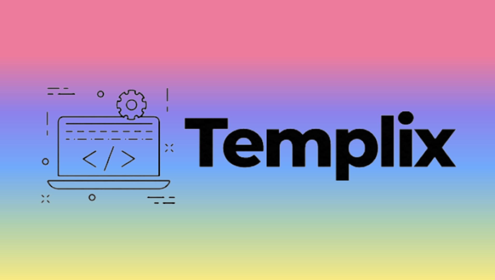

## _Project: [Templix](https://www.templix.mkriegel.me/) Splash Templates_

#### _A website that provides splash page templates that will eventually be able to be downloaded and implemented_

#### By _**Michael Kriegel**_

## Technologies Used

* _React_
* _React-Bootstrap_
* _JSX_
* _Visual Studio Code_
* _SCSS_

## Description

_[Templix](https://www.templix.mkriegel.me/) is a website that provides splash page templates/themes for inspiration or download. Users will be able to view the template, get some information about what the template is built with, file size, instructions on necessary tools to use template, etc. Then users will be able to download the template and implement the template in their own projects. The templates on the website will be completely static, any customization will be done offline by users themselves. Since the download will just be the static template, users will recieve instructions on what technologies are required to be able to use the template. (Currently the download functionality does not execute properly)_

_To learn more about me, visit my portfolio site [mkriegel](https://mkriegel.me)_

## Setup/Installation Requirements

### Online

* _The project is deployed on DreamHost_
* _Visit and view [Templix](https://www.templix.mkriegel.me/) on DreamHost_

### Local Machine

* _Clone or fork this repository_
* _Open the project directory on your local machine_
* _Run `npm install` from the terminal once you have navigated to the project directory_
* _Run `npm start` from the terminal to view the project in the browser using your localhost_

## Known Bugs

* _Download functionality is not working_

## License

[MIT](https://opensource.org/licenses/MIT)

Copyright(c) 2021 Michael Kriegel

## Contact Information

Michael Kriegel: mikkrieg@gmail.com

## Acknowledgements

CSS Background Animation: Hugo Giraudel
